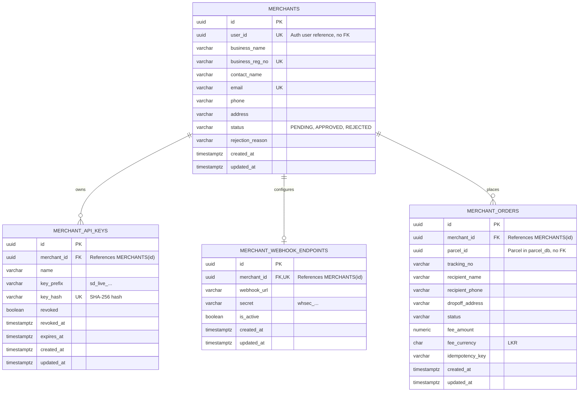

# Merchant Service ER Diagram (`merchant_db`)

```mermaid
erDiagram
    MERCHANTS ||--o{ MERCHANT_API_KEYS : owns
    MERCHANTS ||--o| MERCHANT_WEBHOOK_ENDPOINTS : configures
    MERCHANTS ||--o{ MERCHANT_ORDERS : places

    MERCHANTS {
        uuid id PK
        uuid user_id UK "Auth user reference, no FK"
        varchar business_name
        varchar business_reg_no UK
        varchar contact_name
        varchar email UK
        varchar phone
        varchar address
        varchar status "PENDING, APPROVED, REJECTED"
        varchar rejection_reason
        timestamptz created_at
        timestamptz updated_at
    }

    MERCHANT_API_KEYS {
        uuid id PK
        uuid merchant_id FK "References MERCHANTS(id)"
        varchar name
        varchar key_prefix "sd_live_..."
        varchar key_hash UK "SHA-256 hash"
        boolean revoked
        timestamptz revoked_at
        timestamptz expires_at
        timestamptz created_at
        timestamptz updated_at
    }

    MERCHANT_WEBHOOK_ENDPOINTS {
        uuid id PK
        uuid merchant_id FK,UK "References MERCHANTS(id)"
        varchar webhook_url
        varchar secret "whsec_..."
        boolean is_active
        timestamptz created_at
        timestamptz updated_at
    }

    MERCHANT_ORDERS {
        uuid id PK
        uuid merchant_id FK "References MERCHANTS(id)"
        uuid parcel_id "Parcel in parcel_db, no FK"
        varchar tracking_no
        varchar recipient_name
        varchar recipient_phone
        varchar dropoff_address
        varchar status
        numeric fee_amount
        char fee_currency "LKR"
        varchar idempotency_key
        timestamptz created_at
        timestamptz updated_at
    }
```
