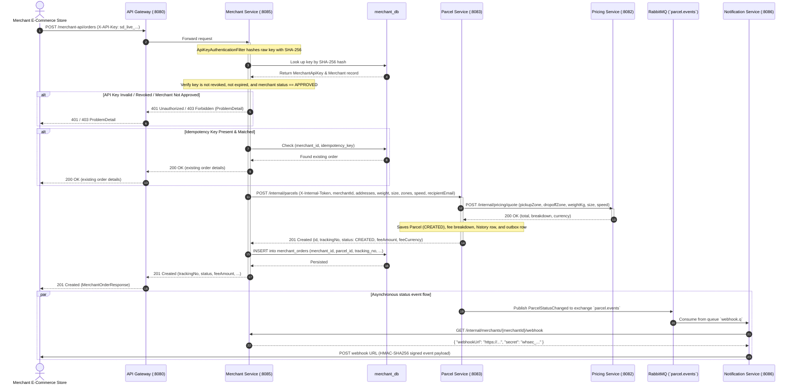

# Merchant Order Creation Sequence Diagram (`seq-merchant-order`)

```mermaid
sequenceDiagram
    autonumber
    actor MerchantStore as Merchant E-Commerce Store
    participant Gateway as API Gateway (:8080)
    participant MerchantSvc as Merchant Service (:8085)
    participant DB as merchant_db
    participant ParcelSvc as Parcel Service (:8083)
    participant PricingSvc as Pricing Service (:8082)
    participant Broker as RabbitMQ (`parcel.events`)
    participant NotifSvc as Notification Service (:8086)

    MerchantStore->>Gateway: POST /merchant-api/orders (X-API-Key: sd_live_...)
    Gateway->>MerchantSvc: Forward request
    activate MerchantSvc

    Note over MerchantSvc: ApiKeyAuthenticationFilter hashes raw key with SHA-256
    MerchantSvc->>DB: Look up key by SHA-256 hash
    DB-->>MerchantSvc: Return MerchantApiKey & Merchant record
    Note over MerchantSvc: Verify key is not revoked, not expired, and merchant status == APPROVED

    alt API Key Invalid / Revoked / Merchant Not Approved
        MerchantSvc-->>Gateway: 401 Unauthorized / 403 Forbidden (ProblemDetail)
        Gateway-->>MerchantStore: 401 / 403 ProblemDetail
    end

    alt Idempotency Key Present & Matched
        MerchantSvc->>DB: Check (merchant_id, idempotency_key)
        DB-->>MerchantSvc: Found existing order
        MerchantSvc-->>Gateway: 200 OK (existing order details)
        Gateway-->>MerchantStore: 200 OK (existing order details)
    end

    MerchantSvc->>ParcelSvc: POST /internal/parcels (X-Internal-Token, merchantId, addresses, weight, size, zones, speed, recipientEmail)
    activate ParcelSvc
    ParcelSvc->>PricingSvc: POST /internal/pricing/quote (pickupZone, dropoffZone, weightKg, size, speed)
    activate PricingSvc
    PricingSvc-->>ParcelSvc: 200 OK (total, breakdown, currency)
    deactivate PricingSvc
    Note over ParcelSvc: Saves Parcel (CREATED), fee breakdown, history row, and outbox row
    ParcelSvc-->>MerchantSvc: 201 Created (id, trackingNo, status: CREATED, feeAmount, feeCurrency)
    deactivate ParcelSvc

    MerchantSvc->>DB: INSERT into merchant_orders (merchant_id, parcel_id, tracking_no, ...)
    DB-->>MerchantSvc: Persisted
    MerchantSvc-->>Gateway: 201 Created (trackingNo, status, feeAmount, ...)
    deactivate MerchantSvc
    Gateway-->>MerchantStore: 201 Created (MerchantOrderResponse)

    par Asynchronous status event flow
        ParcelSvc->>Broker: Publish ParcelStatusChanged to exchange `parcel.events`
        Broker->>NotifSvc: Consume from queue `webhook.q`
        NotifSvc->>MerchantSvc: GET /internal/merchants/{merchantId}/webhook
        MerchantSvc-->>NotifSvc: { "webhookUrl": "https://...", "secret": "whsec_..." }
        NotifSvc->>MerchantStore: POST webhook URL (HMAC-SHA256 signed event payload)
    end
```
