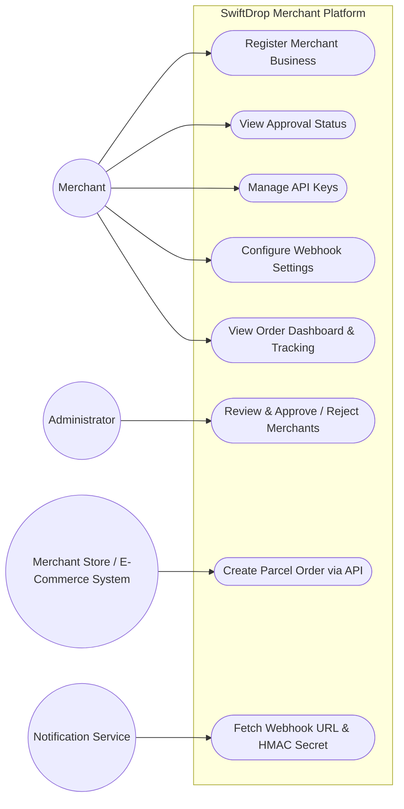

# Merchant Platform Use Case Diagram

```mermaid
flowchart LR
    Merchant((Merchant))
    Admin((Administrator))
    ExtSystem((Merchant Store / E-Commerce System))
    NotificationSvc((Notification Service))

    subgraph SwiftDrop Merchant Platform
        UC1([Register Merchant Business])
        UC2([View Approval Status])
        UC3([Manage API Keys])
        UC4([Configure Webhook Settings])
        UC5([View Order Dashboard & Tracking])
        UC6([Review & Approve / Reject Merchants])
        UC7([Create Parcel Order via API])
        UC8([Fetch Webhook URL & HMAC Secret])
    end

    Merchant --> UC1
    Merchant --> UC2
    Merchant --> UC3
    Merchant --> UC4
    Merchant --> UC5

    Admin --> UC6

    ExtSystem --> UC7
    NotificationSvc --> UC8
```
